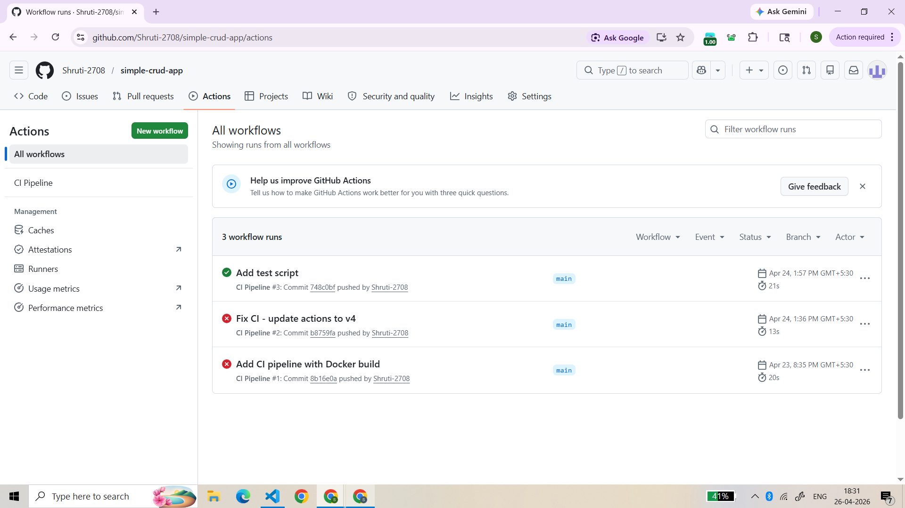
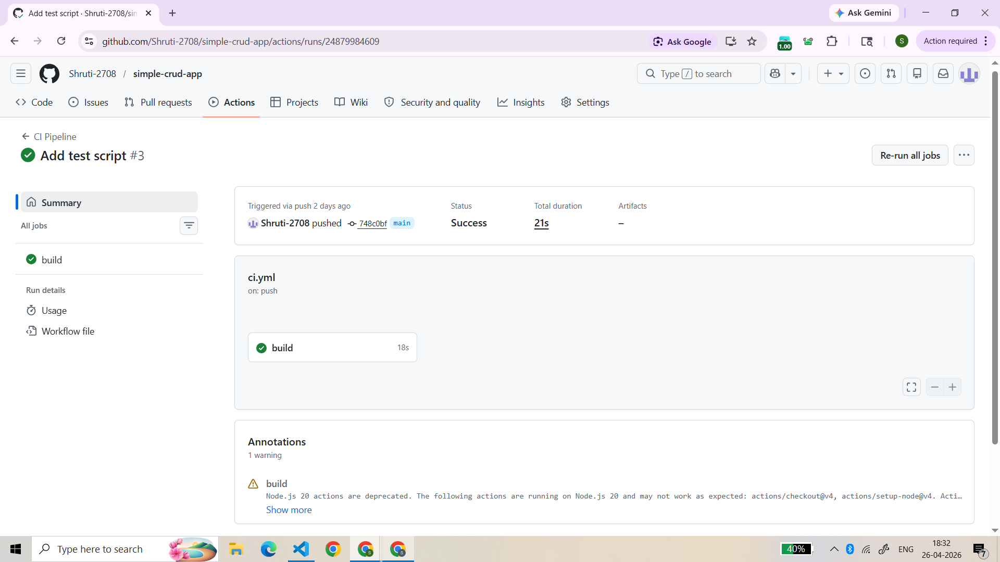

# Simple CRUD App - CI/CD Pipeline

## About
Student CRUD application built with Node.js and Express, containerized with Docker and automated with GitHub Actions CI/CD pipeline.

## CI/CD Execution

## Tech Stack
- Node.js + Express
- Docker
- GitHub Actions

## How to Run
npm install
npm start

## Docker
docker build -t simple-crud-app .
docker run -p 3000:3000 simple-crud-app